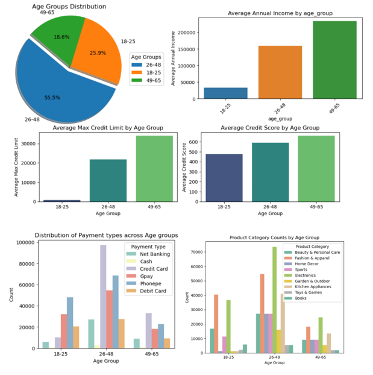

# 🏦 AtliQo Bank Credit Card Launch: Customer Segmentation & A/B Testing

## 📖 Overview
A comprehensive data analytics and statistical testing project designed to identify the optimal target demographic for a new credit card launch. This project bridges the gap between raw transaction data and actionable business strategy through programmatic data engineering, exploratory data analysis (EDA), and rigorous A/B testing.

## 🛠️ Tech Stack & Tools
* **Database & Extraction:** MySQL
* **Data Processing:** Python (Pandas, NumPy)
* **Statistical Modeling:** SciPy, Statsmodels
* **Visualization:** Seaborn, Matplotlib

## 🗂️ Project Structure
* `datasets/` : Contains the raw banking transaction records and customer profiles (CSV format).
* `notebook/` : Contains the Jupyter Notebooks detailing the EDA, data imputation, and Z-Test statistical calculations.
* `assets/` : Contains high-resolution visual outputs and charts generated during the analysis.

---

## 🔍 Phase 1: Market Identification & EDA

### Data Engineering & Cleaning
Extracted over 500,000 transaction records and 1,000 customer profiles from a relational MySQL database. The raw data contained significant anomalies that required programmatic cleaning:
* **Income Imputation:** Addressed missing and zero values in the `annual_income` column using **occupation-based median imputation** (e.g., calculating specific medians for 'Data Scientists' vs. 'Freelancers') to preserve dataset integrity.
* **Outlier Correction:** Identified impossible age entries (e.g., ages 1, 110, and 135). Handled these extreme outliers by replacing them with the median age of their respective occupation groups.

### Key Business Insights
Segmenting the cleaned data into distinct age brackets revealed a massive, untapped market:
1. **The Opportunity:** The 18-25 age demographic accounts for **25.9% of the customer base**.
2. **The Behavior:** This group relies almost entirely on UPI apps (PhonePe, GPay) and debit cards, with near-zero credit card adoption. However, their top three shopping categories are Electronics, Fashion & Apparel, and Beauty & Personal Care.
3. **The Strategy:** Launch an entry-level, UPI-integrated credit card targeted specifically at this demographic to capture their retail spending volume and build early credit habits.

---

## ⚖️ Phase 2: A/B Testing & Statistical Validation

To scientifically prove the effectiveness of the targeted Gen-Z credit card launch, a 62-day pilot campaign was executed and evaluated.

### Test Design & Parameters
* **Target Effect Size:** 0.4 standard deviations.
* **Statistical Power:** 0.8
* **Significance Level (Alpha):** 0.05
* **Calculated Sample Size:** 100 customers (optimized for budgeting constraints via Python's `statsmodels`).

### Campaign Execution
The campaign achieved a **~40% conversion rate**. To ensure rigorous testing, daily average transaction amounts were tracked across 62 days for two exclusive groups:
* **Test Group:** 40 users who adopted the new campaign card.
* **Control Group:** 40 existing users who did not participate in the campaign.

### Results & Conclusion
A right-tailed, two-sample Z-test was conducted to determine if the new card drove higher spending:
* **Control Group Mean:** 221.18 
* **Test Group Mean:** 235.98 
* **Z-Statistic:** 2.748
* **P-Value:** 0.00299

**Verdict:** With a p-value (0.00299) significantly lower than our alpha (0.05), we successfully **reject the null hypothesis**. The data statistically proves that the targeted credit card campaign significantly boosts average transaction amounts.

---
> *Created for analytical portfolio demonstration. Highlights end-to-end capabilities from raw SQL extraction to executive-level statistical validation.*
